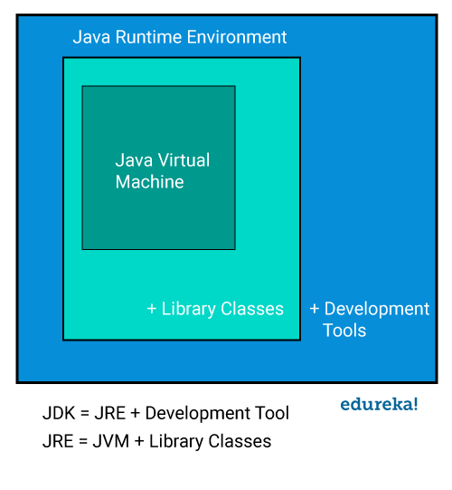

author: Pratham Sarankar
summary: Learn how Java architecture works, including JVM, JRE, JDK, and the compilation process
id: krce-java-selenium-java-architecture
categories: Java,Architecture
environments: Web
status: Published
feedback link: https://github.com/pratham-sarankar/codelabs/issues

# Java Architecture

## Overview

Java architecture is the system that makes Java programs run on different computers.
It includes tools and components that compile and execute Java code safely and efficiently.

This codelab explains the main parts of Java architecture and how they work together.
Students will understand why Java is portable and reliable.

In this codelab, you will learn how to:
- understand JVM, JRE, and JDK
- see how Java code is compiled and run
- learn about key architecture components
- try compiling and running a program to see the process

---

## What is Java Architecture?



*Figure: Java architecture showing JVM inside JRE, with development tools outside in the JDK.*

Java architecture is the design that allows Java programs to run anywhere.
It separates the language from the machine, making Java portable.

The main components are:
- JVM (Java Virtual Machine)
- JRE (Java Runtime Environment)
- JDK (Java Development Kit)

These work together to make Java programs safe, fast, and cross-platform.


---

## JVM: Java Virtual Machine

The JVM is the heart of Java architecture.
It runs Java programs on any device that has a JVM installed.

### What JVM does:
- Executes bytecode (compiled Java code)
- Manages memory with garbage collection
- Provides security by checking code before running
- Optimizes performance with JIT compilation

### Why JVM matters:
Without JVM, Java code couldn't run on different operating systems.
JVM translates bytecode into machine code for each platform.

---

## JRE: Java Runtime Environment

JRE is what you need to run Java programs.
It includes JVM plus standard libraries.

### What's in JRE:
- JVM for executing programs
- Core Java libraries (collections, I/O, networking)
- Configuration files and resources

### When to use JRE:
- To run Java applications (like games or tools)
- On end-user computers that don't need development tools

---

## JDK: Java Development Kit

JDK is for developers who write Java programs.
It includes JRE plus development tools.

### What's in JDK:
- JRE (so you can run programs)
- Compiler (javac) to turn .java files into bytecode
- Debugger and other development tools
- Source code for Java libraries

### When to use JDK:
- When writing, compiling, and testing Java programs
- For software development and building applications

---

## How Java Programs Run

### Step 1: Write code
You write Java code in .java files.

### Step 2: Compile
Use javac to compile .java into .class bytecode files.

### Step 3: Run
Use java to start JVM, which loads and runs the bytecode.

### The process:
Source Code (.java) → Compiler (javac) → Bytecode (.class) → JVM → Machine Code

This process makes Java portable because bytecode works on any JVM.

---

## Key Architecture Features

### Platform Independence
Bytecode runs on any JVM, so Java programs work on Windows, Mac, Linux, etc.

### Security
JVM verifies bytecode before execution and runs code in a sandbox.

### Performance
JIT compiler optimizes bytecode into fast machine code at runtime.

### Memory Management
Garbage collector automatically frees unused memory.

---

## Try Java Architecture: Compile and Run

Create `Greeting.java`:

```java
public class Greeting {
    public static void main(String[] args) {
        System.out.println("Hello from Java Architecture!");
    }
}
```

Compile it:

```bash
javac Greeting.java
```

This creates `Greeting.class` (bytecode).

Run it:

```bash
java Greeting
```

Output:

```text
Hello from Java Architecture!
```

The JVM loaded the bytecode and executed it.

---

## Why this matters

Understanding Java architecture helps students see why Java is reliable and portable.
It explains how Java programs run safely on many platforms.

---

## Next steps

- Learn about Java class loading and classpath
- Explore JVM tuning and performance
- Try building a simple Java application
- Compare Java architecture with other languages
